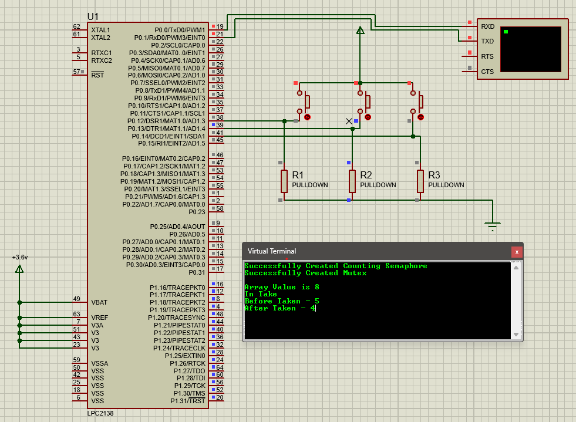

#  LPC2138 FreeRTOS Semaphore & Mutex Demo

## ✅ Overview

This project demonstrates the use of **FreeRTOS counting semaphores and mutexes** on an LPC2138 microcontroller. It simulates shared resource access using push-button switches and provides debug messages via UART.

## 📄 Table of Contents

---

- [Overview](#overview)
- [Schematic](#schematic)
- [Features](#features)
- [Hardware Connections](#hardware-connections)
- [Code Explanation](#code-explanation)
- [Switch Behavior](#switch-behavior)
- [UART Configuration](#uart-configuration)
- [Build & Run](#build--run)
- [Code](#code)
- [Repository Structure](#repository-structure)
- [License](#license)
- [Author](#author)
- [Contact](#contact)

---

## 💡 Schematic

<p align="center">
  
</p>

---

## ✨ Features

- Demonstrates **counting semaphore** for managing shared resource access.
- Uses **mutex** to protect critical sections and avoid race conditions.
- Real-time debug feedback via UART.
- Multi-tasking using FreeRTOS tasks.

---

## ⚡ Hardware Connections

| Component         | LPC2138 Pin | Description                       |
|-------------------|-------------|-----------------------------------|
| Switch 1          | P0.12       | Semaphore take (Task 1)           |
| Switch 2          | P0.14       | Semaphore give                    |
| Switch 3          | P0.13       | Semaphore take (Task 3)           |
| UART0 TX          | P0.0        | Connect to virtual terminal       |
| UART0 RX          | P0.1        | Connect to virtual terminal (optional) |
| Pull-down resistors | All switches | Ensure stable logic when unpressed |

---

## 🧑‍💻 Code Explanation

### Semaphores

- **Counting Semaphore (`m`)**: Controls access to the array `a[]`, initialized to count 5.
- **Mutex (`m2`)**: Ensures only one task prints or updates at a time.

### Tasks

- **lcd1 (Switch 1)**: Takes semaphore, displays array value and count before & after.
- **lcd3 (Switch 3)**: Similar to lcd1, using a separate button.
- **lcd2 (Switch 2)**: Gives semaphore back, displays count before & after.

### Shared Resource

- Array `a[5]` stores data `{8, 3, 5, 6, 7}` accessed cyclically.

---

## 🎛️ Switch Behavior

| Switch   | Action                                |
|-----------|-------------------------------------|
| Switch 1 | Take counting semaphore, show data   |
| Switch 2 | Give counting semaphore              |
| Switch 3 | Take counting semaphore, show data   |

---

## 🔧 UART Configuration

- **Baud rate**: 9600 bps
- **Format**: 8 data bits, no parity, 1 stop bit

```c
U0LCR = 0x83; // Enable DLAB
U0DLL = 98;   // Baud rate divisor for 9600
U0DLM = 0;
U0LCR = 0x03; // Disable DLAB, set 8-bit data

```

## ⚙️ Build & Run

- **Hardware Setup**
  - Connect switches to P0.12, P0.13, and P0.14 with pull-down resistors.
  - Connect UART TX to a virtual terminal or USB-UART converter.

- **Build**
  - Use Keil uVision or any ARM-compatible IDE.
  - Compile `main.c`.

- **Load**
  - Load the generated HEX file onto the LPC2138 microcontroller.
  - Alternatively, simulate the design in Proteus.

- **Interact**
  - Press the switches and observe debug messages on the UART terminal.


## 💻 Code
```c

#include "FreeRTOS.h"
#include "task.h"
#include "semphr.h"

int a[5] = {8, 3, 5, 6, 7};
int index = 0;

void lcd1(void *parm);
void lcd2(void *parm);
void lcd3(void *parm);
void display(const char *);
void trans(char);

SemaphoreHandle_t m, m2;

int main()
{
    PINSEL0 = 1 | 1 << 2;
    U0LCR = 0x83;
    U0DLL = 98;
    U0DLM = 0;
    U0LCR = 0x03;

    PINSEL1 = 0;
    IO0DIR = 0;
    IO1DIR = ~0;

    m = xSemaphoreCreateCounting(5, 5);
    if (m == NULL)
        display("Failed To Create Counting Semaphore\r\n");
    else
        display("Successfully Created Counting Semaphore\r\n");

    m2 = xSemaphoreCreateMutex();
    if (m2 == NULL)
        display("Failed To Create Mutex\r\n");
    else
        display("Successfully Created Mutex\r\n");

    xTaskCreate(lcd1, "Task1", 90, NULL, 0, NULL);
    xTaskCreate(lcd2, "Task2", 90, NULL, 0, NULL);
    xTaskCreate(lcd3, "Task3", 90, NULL, 0, NULL);

    vTaskStartScheduler();
    while (1);
}

void trans(char a)
{
    while ((U0LSR & (1 << 5)) == 0);
    U0THR = a;
}

void display(const char *a)
{
    while (*a)
    {
        trans(*a++);
    }
}

void lcd1(void *parm)
{
    char b;
    while (1)
    {
        if ((IO0PIN & (1 << 12)) == (1 << 12))
        {
            b = uxSemaphoreGetCount(m);
            if (xSemaphoreTake(m, 1000) == 1)
            {
                if (xSemaphoreTake(m2, 3000) == 1)
                {
                    display("\r\nArray Value is ");
                    trans(a[index++] + 48);
                    if (index == 5) index = 0;
                    display("\rIn Take");
                    display("\rBefore Taken - ");
                    trans(b + 48);
                    b = uxSemaphoreGetCount(m);
                    display("\rAfter Taken - ");
                    trans(b + 48);
                    xSemaphoreGive(m2);
                }
                while ((IO0PIN & (1 << 12)) == (1 << 12));
            }
        }
    }
}

void lcd3(void *parm)
{
    char b;
    while (1)
    {
        if ((IO0PIN & (1 << 13)) == (1 << 13))
        {
            b = uxSemaphoreGetCount(m);
            if (xSemaphoreTake(m, 1000) == 1)
            {
                if (xSemaphoreTake(m2, 3000) == 1)
                {
                    display("\r\nArray Value is ");
                    trans(a[index++] + 48);
                    if (index == 5) index = 0;
                    display("\rIn Take");
                    display("\rBefore Taken - ");
                    trans(b + 48);
                    b = uxSemaphoreGetCount(m);
                    display("\rAfter Taken - ");
                    trans(b + 48);
                    xSemaphoreGive(m2);
                }
                while ((IO0PIN & (1 << 13)) == (1 << 13));
            }
        }
    }
}

void lcd2(void *parm)
{
    char b;
    while (1)
    {
        if ((IO0PIN & (1 << 14)) == (1 << 14))
        {
            if (xSemaphoreTake(m2, 3000) == 1)
            {
                b = uxSemaphoreGetCount(m);
                display("\rIn give");
                display("\rBefore Given - ");
                trans(b + 48);
                xSemaphoreGive(m);
                b = uxSemaphoreGetCount(m);
                display("\rAfter Given - ");
                trans(b + 48);
                while ((IO0PIN & (1 << 14)) == (1 << 14));
                xSemaphoreGive(m2);
            }
        }
    }
}
```

## 📁 Repository Structure
```
.
├── schematic.png
├── counting.c
├── README.md
```

## ⚖️ License

This project is open-source and free to use for educational and research purposes.

## 👨‍💻 Author

Ashika K

## 📬 Contact

For any queries, feel free to open an issue or reach me directly on GitHub.

## ⭐ If you found this project helpful, please consider giving it a star!
